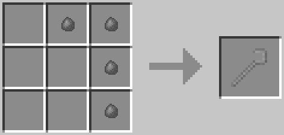
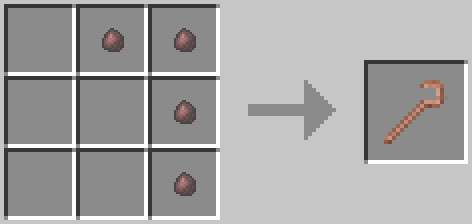

Crooks
======
Crooks are used to obtain resources from leaves. Silkworms can only be obtained by breaking leaves with crooks. The only difference between crooks is their durability.

Recipes
-------
### Wooden Crook


### Stone Crook


### Andesite Crook


### Diorite Crook


### Granite Crook


### Iron Crook


### Gold Crook


### Diamond Crook


### Bone Crook


Configuration
-------------
Configuration for Crook Drops are found in `~/config/exnihilosequentia/CrookRegistry.json`.

The format of the file is: 
```
[
  {
    "result: "modid:name",
    "rarity: 0.0 < number <= 1.0
  },
  ...
]
```
- `modid`: The mod id the block/item/fluid comes from (i.e. `exnihilosequentia`)
- `name`: The name of block/item/fluid (i.e. `witchwater_still`)

- `entry`: The item dropped (Must be an item). Required field.
- `rarity`: Percentage of the time the item will be dropped (Must number greater than 0 and less than or equal to 1). Required field.

You may chain together as many:
```
{
  "result: "modid:name",
  "rarity: 0.0 < number <= 1.0
}
```
blocks as you'd like as long as they are separated by commas and all of them remain inside `[ ]`.
!!! Important
    Duplicate recipes are not allowed. The first recipe in the list will be the one used.